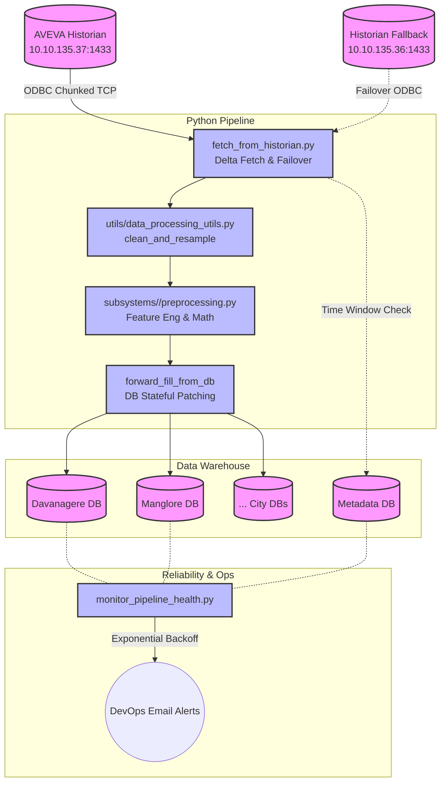

# KMDS Analytics ETL Pipeline

Welcome to the **KMDS Analytics Pipeline**, a production-grade ETL system designed for Smart City data operations.

This pipeline acts as the bridge between raw industrial SCADA systems (AVEVA Historian) and analytical dashboards (PostgreSQL). It handles network failovers, sanitizes messy SCADA data, forward-fills sensor dropouts, calculates analytical metrics, and inserts millions of rows using high-performance UPSERTs.

---

## 🏗️ Architecture & Pipeline Flow

The ETL process runs sequentially but handles subsystems across multiple cities (Davanagere, Hubli-Dharwad, Mangaluru, Shivamogga, Tumakuru).



---

## 🔄 End-to-End Walkthrough

If you are a new developer taking over this project, here is exactly how data moves through the pipeline:

### 1. Extraction (`etl/fetch_from_historian.py`)

- Reads the last runtime from the PostgreSQL `metadata` table to only fetch **delta updates** (new data).
- Validates the network connection. If the primary historian (`10.10.135.37`) is offline or resets the TCP socket, it safely fails over to secondary IPs.
- Queries tags using chunked processing (`TAG_CHUNK_SIZE=50`) or asset prefixing to prevent RAM overload.

### 2. Transformation / Cleaning (`utils/data_processing_utils.py`)

- Industrial data comes tightly packed in "long format". The `clean_and_resample()` utility safely pivots this to wide format.
- Removes garbage Historian error codes (e.g., `-999`).
- Re-samples the data into standard intervals (e.g., 5-minute or 10-minute bins).

### 3. Math & Engineering (`subsystems/<sys>/preprocessing.py`)

- Maps local city identifiers to database column names.
- Computes efficiency metrics, cumulative sums, or utilizes `.diff()` for rate extraction.
- **CRITICAL FEATURE**: Uses `forward_fill_from_db()` to query the PostgreSQL database for the last known sensor value. This bypasses the SCADA "only-log-on-change" issue where Historians stop transmitting data when values don't move.

### 4. Loading (`etl/store_data_to_postgres.py`)

- Employs a high-speed **Bulk UPSERT pattern**.
- Writes DataFrames to in-memory TSV buffers, streams them using PostgreSQL `COPY` into a `temp_table`, and then uses native `ON CONFLICT DO UPDATE` schemas to enforce uniqueness and overwrite stale rows.

### 5. Monitoring (`monitor_pipeline_health.py`)

- Acts as a watchdog running independently via cron.
- Evaluates Data Staleness (e.g., *Is SWM older than 24 hours?*).
- Scrapes tracebacks directly from the `.log` files to categorize whether an error is a Python bug or an ODBC death.
- Uses dynamic exponential cooldowns (6h, 12h, 24h intervals) to alert the DevOps team via Email without spamming them.

---

## � Quick Start & Setup

### Prerequisites

- Python 3.13+
- Installed Microsoft ODBC Driver 17/18 for SQL Server
- Active VPN access to SQL Server Historian networks

### Install & Run

```bash
# 1. Install dependencies
pip install -r requirements.txt

# 2. Set environment variables (or rely on .env)
# 3. Trigger Analytics run
python main.py
```

---

## ➕ Adding a New Subsystem

Follow this strict structure when adding a new utility:

**1. Create the Module**

```text
subsystems/
└── new_subsys/
    ├── __init__.py
    ├── tag.py            # Definition of exact SCADA historian tags
    └── preprocessing.py  # Math and transformation rules
```

**2. Register the module**

- Inside `utils/config.py`, map the subsystem to its tags.
- Inside `main.py`, register the module inside the `SUBSYSTEM_MODULES` dictionary so the fetcher targets it.

**3. Transformation Rules**
Always import and use the central utility rather than inventing custom pivot logic! Custom pivots break on edge cases (like multi-indexing).

```python
from utils import clean_and_resample

def preprocess(raw_df: pd.DataFrame, city: str) -> pd.DataFrame:
    # 1. Standardize and gap-fill
    df_cleaned = clean_and_resample(raw_df, freq="5min")
    
    # 2. Do subsystem-specific math here
    
    return df_cleaned
```

---

## ⚠️ Developer "Gotchas" (What not to do)

- ❌ **Do not write custom SQL strings:** Always use `store_data_to_postgres.py` for Database UPSERTs to prevent schema locks.
- ❌ **Do not handle datetimes natively:** Your output dataframe must always output the `datetime` column explicitly as a column (not as a Pandas index), as the loading script relies on this.
- ❌ **Do not blindly fillna() on cumulative diffs:** If using `.diff()` to calculate deltas, remember that midnight rollovers can cause massive false spikes if NaNs are improperly filled. Always bracket and `.clip()` intervals.

---
**Version:** 3.1 (Production/Stable)
**Last Updated:** April 2026
